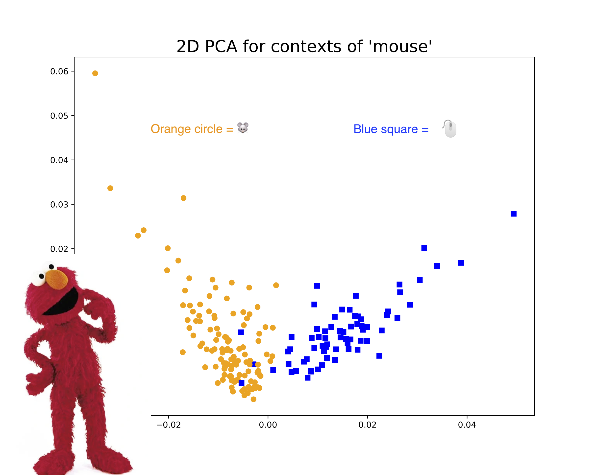

#### Dissertation: "Understanding Political Communication with Contextualized Methods from Natural Language Processing"

I am incredibly fortunate to be advised by an interdisciplinary committee: <a href="https://www.nyu.edu/projects/spirling/">Arthur Spirling (chair)</a>, <a href="https://www.nyu.edu/projects/bowman/">Sam Bowman</a>, <a href="http://www.kyunghyuncho.me/">Kyunghyun Cho</a>, <a href="http://as.nyu.edu/content/nyu-as/as/faculty/jonathan-nagler.html">Jonathan Nagler</a>, and <a href="https://scholar.princeton.edu/bstewart/home">Brandon Stewart</a>.

Abstract: This dissertation is comprised of three projects demonstrating new contextualized natural language processing methods that provide insights about political communication. The first project introduces a measure to better understand political polarization: “contextual polarity,” the divergence in contextual usage of a given word by Republicans versus Democrats. Our analysis of tweets from members of Congress finds that ideologically extreme legislators are generally more likely to use contextually polarizing words in a manner consistent with their party, although there is notable intrapersonal variation across topics and across personal versus official Twitter accounts. The second project presents a framework for optimally clustering questions and answers using the Question Typology model. Our case studies of the Leveson public inquiry on media ethics and the war crimes trial of Charles Taylor identify clusters of questions which are consistent with patterns in how different types of witnesses are treated in cross-examination. The last project augments the stylest model of speaker distinctiveness with a new measure of word dissimilarity. In our study of rebellious behavior in the UK House of Commons (1935–2018), we find that government backbenchers are more distinctive than their opposition counterparts, and that distinctiveness is associated with future promotion.

[<a href="https://github.com/leslie-huang/dissertation_code">code</a>]

&bull; &bull; &bull;

#### Huang, L., P. Perry, and A. Spirling. "A General Model of Author 'Style' with Application to the UK House of Commons, 1935–2018." _Political Analysis_, 28(3), 412-434. <a href="https://doi.org/10.1017/pan.2019.49">https://doi.org/10.1017/pan.2019.49</a>.

Abstract: We consider the merits of claims that Members of Parliament (MPs) in the UK have become more ‘boring’ over time--that is, less distinctive from one another in terms of their speech and style. We review theory and previous findings in the area, and note their ambiguity in predictions on this matter. We then provide an efficient new measurement model of distinctiveness that extends traditional efforts to statistically characterize the ‘style’ of authors, and apply it to a corpus of Hansard speeches from 1935 to 2018. In the aggregate, we find no evidence for the claim of increased boringness. But this hides intriguing covariate effects: at the MP level, panel regression results demonstrate that on average, more senior backbenchers tend to be less interesting in speech terms. We also show, however, that this pattern is changing: in recent times, it is more experienced MPs who speak most distinctively.

[<a href="https://cran.r-project.org/web/packages/stylest">R package on CRAN</a>: install using `install.packages("stylest")`, <a href="https://cran.r-project.org/web/packages/stylest/vignettes/stylest-vignette.html">vignette</a>]

&bull; &bull; &bull;

#### Huang, L., K. Cho, and S. Bowman. "Can we identify word senses from deep contextualized word embeddings without supervision?"

Abstract: In fields such as political science, applied text analysis often assumes there is only one sense (meaning) for a word. However, we know that words can have multiple senses: for instance, “mouse” can refer to the rodent or the computer device. Can we extract multi-sense word representations from deep language models such as BERT and ELMo to use in downstream text analysis tasks? In order to be able to detect word senses without any supervision, we need to go farther and develop a method to estimate the number of word senses for each unique word. We run a series of experiments to predict the number of word senses experimentally, and use WordNet (via PyDictionary) and Wiktionary — a common NLP dataset and a crowdsourced online dictionary, respectively — as our “ground truth” number of word senses. However, we consistently find poor correlation between our model’s predicted number of word senses and WordNet/Wiktionary. We point to several issues that may explain these results.

[<a href="https://medium.com/@leslie_huang/automatic-extraction-of-word-senses-from-deep-contextualized-word-embeddings-2f09f16e820">Medium post</a>, <a href="https://github.com/leslie-huang/howmanywordsenses">code</a>]

