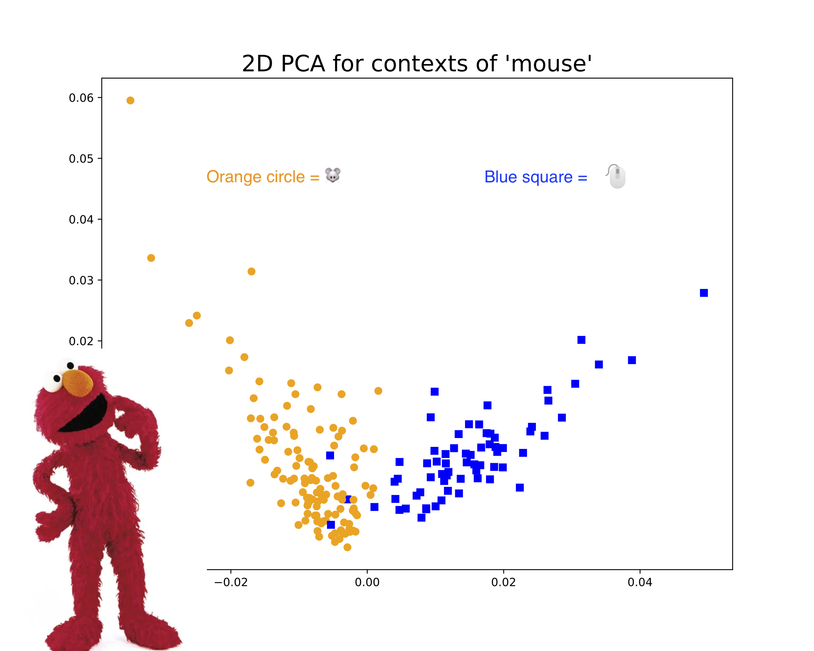

# Dissertation

#### "Understanding Political Communication with Contextualized Methods from Natural Language Processing"

I am incredibly fortunate to have an interdisciplinary committee to advise me on my interdisciplinary research: <a href="https://www.nyu.edu/projects/spirling/">Arthur Spirling (chair)</a>, <a href="https://www.nyu.edu/projects/bowman/">Sam Bowman</a>, <a href="http://www.kyunghyuncho.me/">Kyunghyun Cho</a>, <a href="http://as.nyu.edu/content/nyu-as/as/faculty/jonathan-nagler.html">Jonathan Nagler</a>, and <a href="https://scholar.princeton.edu/bstewart/home">Brandon Stewart</a>.

&bull; &bull; &bull;

# Publications

#### Huang, L., P. Perry, and A. Spirling. "A General Model of Author 'Style' with Application to the UK House of Commons, 1935–2018." _Political Analysis_, 28(3), 412-434. <a href="https://doi.org/10.1017/pan.2019.49">https://doi.org/10.1017/pan.2019.49</a>.

We consider the merits of claims that Members of Parliament (MPs) in the UK have become more ‘boring’ over time--that is, less distinctive from one another in terms of their speech and style. We review theory and previous findings in the area, and note their ambiguity in predictions on this matter. We then provide an efficient new measurement model of distinctiveness that extends traditional efforts to statistically characterize the ‘style’ of authors, and apply it to a corpus of Hansard speeches from 1935 to 2018. In the aggregate, we find no evidence for the claim of increased boringness. But this hides intriguing covariate effects: at the MP level, panel regression results demonstrate that on average, more senior backbenchers tend to be less interesting in speech terms. We also show, however, that this pattern is changing: in recent times, it is more experienced MPs who speak most distinctively.

&bull; &bull; &bull;

#### Huang, L., K. Cho, and S. Bowman. "Can we identify word senses from deep contextualized word embeddings without supervision?" [<a href="https://medium.com/@leslie_huang/automatic-extraction-of-word-senses-from-deep-contextualized-word-embeddings-2f09f16e820">post here</a>]

